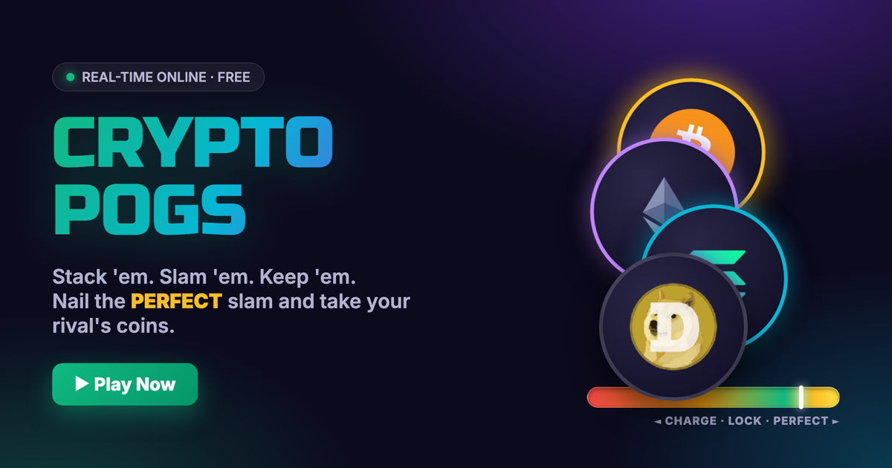
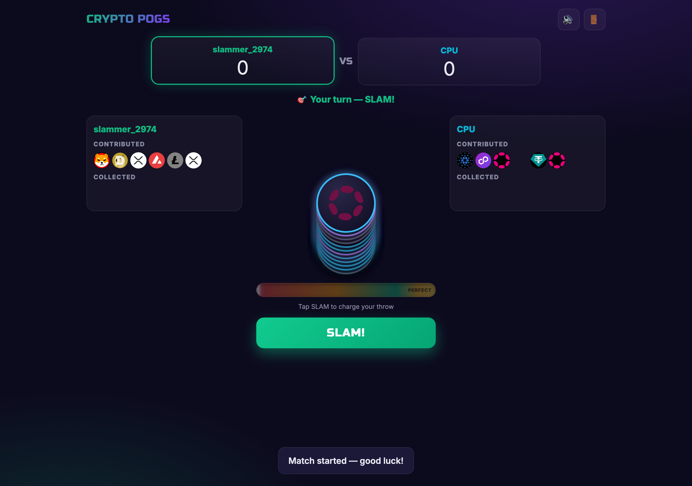
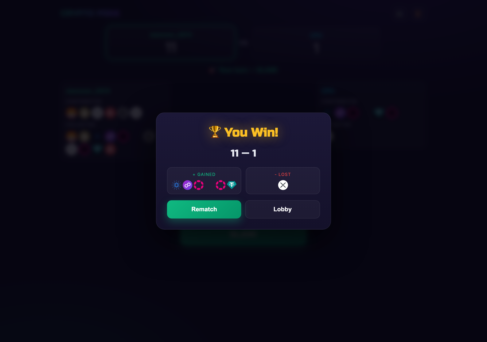

# 🪙 Crypto Pogs — Stack 'em. Slam 'em. Keep 'em.



A real-time, online **pog-slamming battle** with a crypto twist. The 90s playground
classic reborn: ante up your coins, charge a skill-based slam, nail the **PERFECT**
zone, and flip your opponent's pogs into your own collection.

🌐 **Landing page:** [cryptopogs.remotebb.com](https://cryptopogs.remotebb.com)

---

## 🎲 Two ways to play

| | **Browser Demo** | **Full Game** |
|---|---|---|
| Play | [cryptopogs.remotebb.com/demo.html](https://cryptopogs.remotebb.com/demo.html) | Run it yourself (below) |
| Mode | Single-player vs CPU | Single-player **+ real-time online multiplayer** |
| Setup | None — runs entirely in your browser | `npm install` + `node server.js` |
| Accounts | Local W/L record (localStorage) | Real accounts, inventories & W/L (SQLite) |

The demo (`demo.html`) is a fully client-side build — no server, no install — great for a quick taste.
The full game (`server.js`) adds account-based play and live head-to-head matches over the web.

---

## ✨ Features

- ⚡ **Real-time multiplayer** — create a room, share the name, slam head-to-head over the web (Socket.IO)
- 🎯 **Skill-based slams** — a timing power meter, not a mindless coin flip. Hit the gold zone for a PERFECT
- 🤖 **Solo vs CPU** — warm up against a CPU that throws its own perfect slams
- 💥 **Pure juice** — screen shake, particle bursts, flying pogs, confetti, and a full WebAudio sound kit
- ✨ **Rarity tiers** — 20 crypto pogs from common → legendary, each with its own glow
- 🏆 **Persistent loot** — accounts, inventories, and win/loss records; what you win, you keep

## 🎮 How to play

1. **Ante up** — you and your opponent each toss 6 pogs into a shared vertical **stack** of 12.
2. **Aim** — a line sweeps up & down the stack; tap to choose *which height* to strike.
3. **Power** — stop the meter in the gold **PERFECT** zone. Power = how far the shock reaches through the stack.
4. **Keep the spoils** — pogs caught in the blast flip face-up and you keep 'em. Hunt the gold **2× pogs**, pop 💣 **bombs** (chain-flip neighbours), and bring power to crack 🔒 **locked** pogs. Chain good slams to go 🔥 **on fire** (×1.5 points). Higher score wins.

**Single-player demo** also has a **gauntlet** (Rookie → Legend) and **unlockable slammers** with trade-offs.

| In-game | Victory |
|---|---|
|  |  |

## 🚀 Run it locally

```bash
git clone https://github.com/rmtbb/cryptoPogs.git
cd cryptoPogs
npm install
node server.js
# → open http://localhost:3000
```

Then open a second browser/tab to play multiplayer, or hit **Single Player** to battle the CPU.

## 🧱 Tech stack

- **Backend:** Node.js, Express 5, Socket.IO 4
- **Database:** SQLite3 (bcrypt password hashing)
- **Frontend:** single-file HTML/CSS/JS with the Socket.IO client — no build step

## 📂 Project layout

| File | Purpose |
|---|---|
| `server.js` | Express + Socket.IO server, game logic, server-authoritative slams |
| `database.js` | SQLite wrapper — auth, inventories, win/loss |
| `coins.js` | Shared crypto-pog roster with rarity tiers |
| `pogsthegame.html` | The game client (UI, animations, sound, power meter) |
| `index.html` | Marketing landing page |

> **Note:** A Solana/token betting economy was prototyped (`solana/`) but is currently
> shelved — the focus is on making the game itself fun. Those deps are dormant.

---

Built for fun. PRs welcome. 🤝
